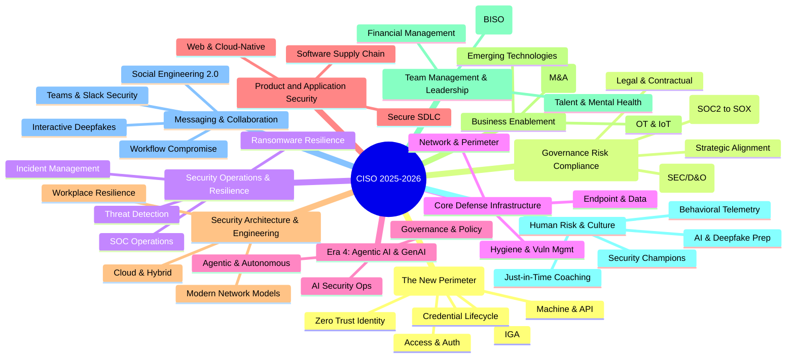

# CISO MindMap 2025 - Modernized

See https://rafeeqrehman.com/ciso-mindmap/

## Identity (The New Perimeter)

### Identity Governance and Administration (IGA)
* Role-Based Access Control (RBAC) & Attribute-Based Access Control (ABAC)
* User Access Reviews (UAR)
* Entitlement Management
* Segregation of Duties (SoD) enforcement

### Identity Credentialing and Lifecycle
* User Provisioning and Identity Life Cycle Management
* HR Process Integration (Onboarding/Offboarding)
* Directory Services (LDAP/Active Directory, Cloud Identity, Local ID stores)
* Unified Identity Profiles

### Access Management and Authentication
* Single Sign On (SSO)
* Federation (SAML, OIDC, OAUTH)
* 2-Factor (multi-factor) Authentication - MFA
  * Authenticator Apps
  * Tokens and cards
  * One time passcodes
* Password-less Authentication
  * Passkeys
  * Biometrics (Voice, Face)
* Customer Identity and Access Management (CIAM)
* Privileged Access Management (PAM)
* Use of public identity (Google, FB, OAuth, OpenID)

### Machine and API Identity
* API authentication and secrets management
* IoT device identities
* Service accounts & workload identities

### Zero Trust Identity
* IAM with Zero Trust technologies
* Continuous Authentication
* Context-based access

## Governance, Risk, and Compliance (GRC)

### Strategic Alignment and Leadership

#### Strategy and Business Alignment
* **Outcome-Based Metrics (The Shift from Effort to Impact):**
  * Move from technical KPIs (patches/vulns) to business impact metrics (MTTD/MTTC relative to revenue downtime).
  * Align with P&L goals: Show how security enables specific business initiatives (e.g., "Securing the AI-driven customer chatbot project").
* **CISO as a Business Control Executive:**
  * Transition from technical operator to a peer of the CFO/COO.
  * Authority to manage risk thresholds for product launches and vendor onboarding.
* **The Federated Alignment Model:**
  * Embedding security within Business Units (BISO role) to ensure security is "built-in" to local functional goals.

#### Board Oversight and Board Presentations
* **Defensible Materiality (SEC Compliance):**
  * Aligning with SEC Reg S-K Item 106 (Governance) and 8-K Item 1.05 (Materiality).
  * Presentation of the "Materiality Playbook": Pre-defined financial and qualitative thresholds for reporting.
* **The 4-Day Materiality Clock:**
  * Board reporting focuses on the *process* of determining materiality rather than just technical incident details.
* **The 2025 Board Deck Structure:**
  * Top 3 Material Risks (Financial exposure vs. Probability).
  * Governance Maturity: Proof of board oversight duty and management's expertise.
  * Resource Alignment: Connecting budget requests directly to the reduction of financial Value-at-Risk (VaR).

#### Cyber Risk Quantification (CRQ) - FAIR Framework
* **The FAIR Model (Factor Analysis of Information Risk):**
  * **Loss Event Frequency (LEF):** Threat Event Frequency + Vulnerability (Resistance vs. Threat Capability).
  * **Loss Magnitude (LM):** Primary Loss (Incident Response) + Secondary Loss (Fines, Churn, Brand Damage).
* **Monte Carlo Simulations:**
  * Moving beyond Heat Maps (Red/Yellow/Green) to probable financial outcomes (e.g., "10% chance of $5M loss").
* **Decision Support:**
  * Using CRQ to prioritize the security roadmap based on ROI rather than technical severity.

#### Security Team Branding & Value Creation
* **Internal Security Marketing:**
  * Shift from the "Department of No" to the "Department of How."
  * **Relationship Currency:** One-on-one roadshows with HR, Finance, and Product heads to understand *their* friction points.
* **Security as a Brand Differentiator:**
  * Leveraging privacy and security as a competitive advantage (e.g., Apple's "Privacy" brand).
  * Building "Customer Trust Portals" to accelerate sales cycles and RFP responses.
* **Innovation & Friction Reduction:**
  * **Zero Trust as an Enabler:** Speeding up M&A integration and secure remote work productivity.
  * **Security-as-Code:** Automating compliance to allow developers to move faster with safety guardrails.
* **Negotiation & "Give and Take":**
  * Trading strict controls in low-risk areas for mandatory adherence in high-risk zones (Risk-Based Governance).
* **ROSI (Return on Security Investment):**
  * **Formula:** $ROSI = \frac{(ALE \times Mitigation Ratio) - Cost of Solution}{Cost of Solution}$
  * **ALE (Annualized Loss Expectancy):** Single Loss Expectancy (SLE) $\times$ Annual Rate of Occurrence (ARO).
  * Demonstrating loss avoidance as a tangible contribution to the bottom line.

### Risk Management and Liability

#### Enterprise Risk Management (ERM)
* **Framework Integration (COSO & ISO 31000):**
  * Shifting cyber from a technical silo to a primary ERM pillar.
  * Mapping "Crown Jewel" assets to business objective disruption rather than IT inventory.
* **NIST SP 1308 (2025) Implementation:**
  * Using the "Cybersecurity Framework 2.0 Quick-Start Guide" to integrate CSRM (Cybersecurity Risk Management) with Enterprise Risk.
  * Transitioning from periodic assessments to a "Portfolio View" of risk.
* **The "Three Lines" Model:**
  * **1st Line:** Operations (Security/IT) owning control execution.
  * **2nd Line:** Risk/Compliance (ERM) providing oversight and framework.
  * **3rd Line:** Internal Audit providing independent assurance.

#### Personal Liability & Indemnification
* **The SolarWinds Recalibration (Post-Nov 2025):**
  * Shift from fear of personal enforcement for technical gaps to a focus on **Fraudulent Disclosure**.
  * Defensive documentation: Maintaining a formal "Paper Trail" of risk-based decisions and budget requests to demonstrate good faith.
* **SEC Disclosure Requirements (Materiality):**
  * Personal liability tied primarily to **Affirmative Misrepresentations** in 8-K/10-K filings.
  * Cross-functional Materiality Committees (CISO, Legal, CFO) to ensure unified disclosure decisions.
* **Personal Indemnification Agreements:**
  * Moving beyond corporate bylaws to bilateral contracts that guarantee legal defense regardless of company solvency.

#### Directors and Officers (D&O) Insurance
* **Explicit CISO Inclusion:**
  * Ensuring the C-level CISO is defined as a "Duly Elected or Appointed Officer" in the primary policy.
* **Side A DIC (Difference in Conditions):**
  * Essential personal backstop: Triggers when the company cannot or will not indemnify the CISO (e.g., in derivative suits or insolvency).
  * Ensuring "Defense Outside Limits" (DOL) to prevent legal fees from eroding settlement coverage.
* **Investigation & "Pre-Claim" Coverage:**
  * Coverage for responding to SEC "Wells Notices" or informal regulatory inquiries before a formal lawsuit is filed.

#### Cyber Risk Insurance (2025 Trends)
* **Market Dynamics:**
  * Softening premiums for "High-Hygiene" organizations; denials for those without MFA/EDR and AI Governance.
* **AI and Systemic Risk Exclusions:**
  * Stricter language around "Black Swan" events (e.g., major cloud/infrastructure outages).
  * **Affirmative AI Endorsements:** Clarifying coverage for weaponized AI attacks while excluding model bias or IP hallucinations.
* **War & Infrastructure Exclusions:**
  * Explicit denials for state-sponsored attacks and national infrastructure (satellite/telecom) failures.

#### Maintain Centralized Risk Register
* **From Static Spreadsheets to "Risk-as-Code":**
  * Real-time CSRRs (Cybersecurity Risk Registers) that roll up technical telemetry into ERM-level risk scores.
* **Continuous Control Validation (CCV):**
  * Using BAS (Breach & Attack Simulation) to provide evidence-based risk scoring.

#### Third-Party & Nth-Party Risk Management (TPRM)
* **TPRM Automation (Autonomous TPRM):**
  * AI-powered ingestion and scoring of SOC 2/ISO reports (80% manual effort reduction).
  * Shift from "Annual Questionnaires" to **Continuous Ecosystem Monitoring**.
* **Fourth-Party (Nth-Party) Risk:**
  * Mapping concentration risk: Identifying hidden dependencies on shared sub-providers (e.g., multiple vendors using the same CDN).
  * Contractual Flow-Downs: Requiring third parties to maintain Nth-party oversight.
* **The "Algorithmic Supply Chain":**
  * Due diligence for vendors embedding AI models/APIs: Verifying data provenance and model governance.

### Compliance and Audits
* The Compliance Transition (SOC 2 vs. SOX 404)
  * SOC 2 as Revenue Enabler (Pre-IPO)
  * SOX 404 as Fiduciary Governance (Post-IPO)
* Global Privacy Regulations (CCPA, GDPR, etc.)
* Industry Standards (PCI, HIPAA/HITECH, HITRUST, DORA)
* Government Standards (NIST/FISMA, CMMC)
* Regular Audits and SSAE 18

### Legal and Contractual

#### Data Discovery and Data Ownership
* **AI-Driven Data Discovery (DSPM):**
  * Transition from static asset lists to **Data Security Posture Management (DSPM)** for continuous, automated discovery.
  * Focus on **Unstructured Data Sprawl**: Sifting through emails, chats, and PDFs that fuel LLMs.
  * Identifying "Shadow AI": Tracking unauthorized data uploads to personal GenAI accounts.
* **Modern Ownership Models:**
  * **Data Mesh Architecture:** Decentralizing accountability to individual business domains ("Data-as-a-Product").
  * **Machine Identity for AI Agents:** Assigning distinct identities to autonomous agents to track data access and lineage.
  * **Data Sovereignty & Localization:** Mapping data flows to comply with regional residency requirements (e.g., Sovereign AI initiatives).

#### Vendor Contracts & Indemnification
* **Cyber-Specific Indemnification:**
  * Explicitly covering forensic costs, regulatory fines, legal defense, and consumer notification.
  * Third-party claims: Vendors must indemnify against failures in their own sub-processor (Nth-party) ecosystem.
* **Negotiating Liability Caps:**
  * **The "Super Cap":** Insisting on a separate, higher cap (e.g., 5x annual fees) for data breaches and privacy violations.
  * **Uncapped Carve-outs:** Gross negligence, willful misconduct, and breach of core confidentiality obligations.
* **Notification SLAs (The "24-Hour Rule"):**
  * Requiring notification within 24 hours of *suspected* incident discovery to meet SEC/CIRCIA windows.
  * Mandating participation in the company's annual Tabletop Exercises for critical vendors.

#### Investigations and Forensics
* **Cloud-Native Forensics:**
  * Shifting from disk-based forensics to **Log and Identity-based analysis** (IAM, S3, Kubernetes logs).
  * Addressing "Living-off-the-Cloud" techniques: Tracing abuse of native cloud capabilities.
* **AI-Augmented DFIR:**
  * Using NLP to sift through years of communication logs in minutes.
  * Automated triage and pattern recognition to identify Indicators of Compromise (IOCs) at scale.
* **Forensic Readiness:**
  * Pre-configuring ephemeral environments (Serverless, Containers) to ensure audit trails are preserved *before* an incident occurs.

#### Attorney-Client Privilege (The 2025 Standard)
* **The "Dual-Track" Investigation Model:**
  * **Track 1 (Operational):** Non-privileged remediation and business continuity.
  * **Track 2 (Legal):** Privileged track directed by outside counsel to determine liability and regulatory obligations.
* **The Kovel Agreement:**
  * Extending privilege to third-party forensic firms via direct retention by outside counsel.
* **Maintaining Privilege Hygiene:**
  * Avoiding "on-retainer" vendors for Track 2 (to prevent "business-as-usual" rulings).
  * Limiting distribution of findings to a strictly defined "need-to-know" group.
  * Prioritizing "Counsel's Memoranda" over standalone vendor technical reports.

#### Data Retention and Destruction
* **The "Regulatory Clock" Conflict (AI Act vs. GDPR):**
  * **High-Velocity Deletion:** Purging raw personal training data immediately after model finalization (GDPR).
  * **High-Durability Retention:** Keeping AI technical documentation and logs for 10 years (EU AI Act).
* **Machine Unlearning:**
  * Implementing processes to remove the influence of an individual's data from a trained model ("Right to be Forgotten" for AI).
* **Privacy-Enhancing Technologies (PETs):**
  * Using Differential Privacy and Anonymization to keep data for research while meeting destruction mandates.
* **Automated Deletion Protocols:**
  * Policy-driven, automated purging that extends to backups and sub-processors with verified "Certificates of Destruction."

## Security Operations & Resilience

### Threat Detection (NIST CSF Detect)
* Log Analysis/correlation/SIEM
* Alerting (IDS/IPS, FIM, WAF, Anti-Malware, etc.)
* NetFlow analysis
* Threat hunting and Insider threat
* MSSP/MDR integration
* Threat Detection capability assessment (Gap analysis)

### SOC Operations
* SOC Resource Mgmt
* SOC procedures, Shift management, and Metrics
* SOC and NOC Integration
* Partnerships with ISACs
* Long term trend analysis
* Automation and SOAR (Playbooks)

### Incident Management (NIST CSF Respond & Recover)
* Create adequate Incident Response capability
* Incident Response Playbooks
* Incident Readiness Assessment
* Data Breach Preparation
  * Update and Test IR Plan
  * Set Leadership Expectations
  * Forensic and IR Partner/Retainer
  * Media Relations

### Ransomware and Cyber Resilience
* Identify critical systems
* Perform ransomware BIA (Business Impact Analysis)
* Tie with BC/DR Plans
* Devise containment strategy
* Resilience Equity: Ensure adequate/offline backups
* Periodic mock exercises

### Skills Development
* Machine Learning & Data Analytics
* Understand Algorithm Biases
* MITRE ATT&CK
* Soft skills & Conflict Management

## Core Defense Infrastructure

### Network and Perimeter Security
* Network/Application Firewalls
* Network IPS and IDS
* DDoS Protection
* DNS security/filtering
* Proxy/Content Filtering

### Endpoint and Data Security
* Anti-Malware & EDR
* Desktop & Mobile security
* Data Loss Prevention (DLP)
* Encryption, SSL, PKI, Digital Certificates

## Email, Messaging & Collaboration Security

### Social Engineering 2.0 & Synthetic Familiarity
* **Beyond Phishing (Workflow Compromise):**
  * Attackers inserting themselves into existing business processes (e.g., vendor onboarding, invoice approval).
  * Use of LLMs to mirror internal tone, cadence, and professional vocabulary with 100% accuracy.
* **BCC & "Ghosting" Tactics:**
  * Silent monitoring of high-value email threads via Account Takeover (ATO).
  * "Jumping in" at the point of transaction to redirect funds.
* **ClickFix & Browser-Based Attacks:**
  * Tricking users into running malicious terminal commands to "fix" application errors, bypassing traditional email filters.

### Collaboration & Unified Communications (UC)
* **Teams, Slack, and Zoom Security:**
  * Defending against "Internal Trust" abuse: Impersonating IT/Helpdesk within internal messaging apps.
  * Scanning internal collaboration channels for malicious links and anomalous behavior.
* **Interactive Deepfakes (Real-Time Fraud):**
  * Transitioning from recorded audio to live, interactive voice/video deepfake calls.
  * Mandatory "Challenge-Response" protocols (Out-of-band shared secrets) for verbal authorization of funds.

### Technical Defenses & Enforcement
* **Behavioral AI Analysis:**
  * Shifting from signature-based detection to "Intent Analysis": Identifying anomalous requests (e.g., CFO asking for a policy exception).
* **Identity-Centric Protection:**
  * Defending against MFA Bypass (AiTM): Captured session cookies and proxy-based phishing.
  * Transitioning to **Phishing-Resistant MFA** (FIDO2 / Passkeys) for high-risk users.
* **Infrastructure Hardening:**
  * Mandatory DMARC Enforcement (Reject Policy) as a baseline for cyber insurance and deliverability.
  * Automated cleanup: Post-delivery remediation to "claw back" malicious emails after they reach the inbox.

### Hygiene and Vulnerability Management
* Vulnerability Management Scope (OS, Apps, DBs, IoT, OT)
* Risk-Based Prioritization (EPSS)
* Patch Management (SLA-driven)
* Hardening guidelines
* Asset Management & Asset Inventory
* Security Health Checks

## Era 4: Agentic AI & GenAI

### AI Governance and Policy
* AI Governance, Policies, Transparency
* Safe and ethical uses of GenAI
* Protecting Intellectual Property
* NIST AI Risk Mgmt Framework
* EU AI Act Compliance

### Agentic AI and Autonomous Systems
* Governing Autonomous Agents
* Agent Hijacking & Prompt Injection defense
* Shadow AI Data Exfiltration detection
* AI Red Teaming

### AI Security Operations
* Securing AI/GenAI models
* Securing training and test data (Model Poisoning)
* Adversarial attacks
* AI-enabled security tools
* Train InfoSec teams on AI technologies
* OWASP Top 10 LLM and GenAI risk

## Product and Application Security

### Secure Development Lifecycle (SDLC)
* Integration to SDLC and Project Delivery
* Embedding security in Project Requirements
* Threat modeling and Design reviews
* Secure Code Training and Review
* Application Vulnerability Testing (SAST/DAST)
* Change Control & File Integrity Monitoring (FIM)

### Software Supply Chain Security
* Inventory open source components (SCA)
* Source code supply chain security (SBOM)
* Public software repositories

### Web and Cloud-Native Security
* Web Application Firewall (WAF)
* API Security
* Containers and Kubernetes security
* Serverless computing security
* Service mesh & microservices

## Security Architecture & Engineering

### Cloud and Hybrid Architecture
* Multi-Cloud architecture strategy
* Cloud Security Posture Management (CSPM)
* Infrastructure as Code (IaC) Security
* Virtualized security appliances

### Modern Network Models
* Traditional Network Segmentation
* Micro-segmentation strategy
* Zero Trust models and roadmap
* SASE/SSE strategy and vendors
* Overlay networks & secure enclaves

### Workplace & Infrastructure Resilience
* Zero trust access to applications
* Secure expanded attack surface (Remote Work)
* Security of sensitive data accessed from home
* Mobile Technologies (BYOD, MDM)

## Business Enablement & Industry Verticals

### Strategic Growth
* Mergers and Acquisitions (M&A)
  * Acquisition Risk Assessment
  * Integration Cost & Tools Rationalization
* Business Partnerships
* Agility, Business Continuity and Disaster Recovery

### Operational Technology (OT) & IoT
* OT/SCADA & Industrial Control Systems (PLCs, HMIs)
* IoT Frameworks & Communication Protocols
* IOT Use cases (Smart Grid, Cities, Communities)
* Edge Computing

### Emerging Technologies
* Evaluating Quantum, Crypto, etc.
* Augmented and Virtual Reality
* Drones

## Team Management & Leadership

### Organizational Design and Roles
* Federated Model (BISO - Business Information Security Officer)
* Virtual CISO (vCISO) model for SMBs
* Alignment with IT, Engineering, and Business units

### Financial Management
* Manage Infosec Budget (CapEx and OpEx)
* Business Case Development
* Consulting and outsourcing
* Retire redundant & under-utilized tools

### Staffing and Talent Management
* Recruiting, performance, and retention
* Addressing the Human Cost: Burnout Prevention & Mental Health
* Balance FTE and contractors
* Staff training and skills update

## Human Risk Management & Security Culture

### From Awareness (SAT) to Risk Management (HRM)
* **Behavioral Telemetry & Scoring:**
  * Ingesting 200+ signals (IAM, DLP, Email, Web) to create a dynamic "Human Risk Score."
  * Moving from quiz scores to actual behavior tracking (e.g., "MFA fatigue response").
* **Just-In-Time (JIT) Coaching:**
  * Real-time "Nudges" triggered by risky actions (e.g., uploading IP to personal cloud).
  * Adaptive interventions based on the individual's specific risk profile.

### Defending the Modern Workforce
* **AI & Deepfake Verification:**
  * Training for "Contextual Skepticism" in an era of perfect AI-generated phishing.
  * Deepfake response protocols: Out-of-band identity verification for voice/video requests.
* **AI Agent Interaction Risk:**
  * Governing how humans grant permissions to semi-autonomous AI agents.
  * Preventing "Prompt Injection" and data leakage via human-AI interaction.

### Building a Resilient Culture
* **Security Champion Programs:**
  * Deputizing influential non-security peers to advocate for security in every business unit.
* **Human-Centric Design:**
  * Reducing "Security Friction": Making the secure path the path of least resistance.
  * Gamification & Positive Reinforcement: Rewarding "Good Catches" rather than just punishing failures.
* **The "No-Blame" Reporting Brand:**
  * Marketing the SOC as a help desk for mistakes to encourage immediate breach reporting.
* **Personal Benefit Training:**
  * Teaching employees to secure their families/homes to build goodwill and security habits.
