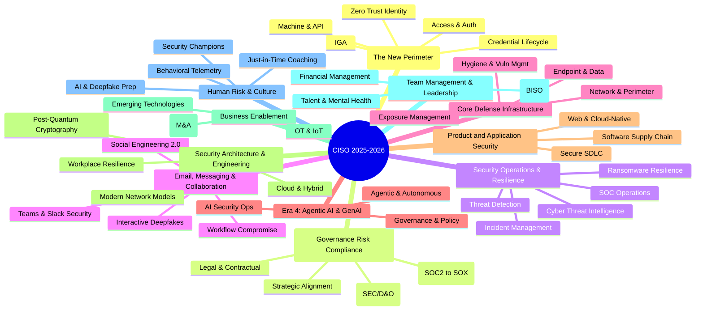

# CISO MindMap 2025 - Modernized

See https://rafeeqrehman.com/ciso-mindmap/

## Identity (The New Perimeter)

### Identity Governance and Administration (IGA)
* Role-Based Access Control (RBAC) & Attribute-Based Access Control (ABAC) — assign access by job role or business attributes.
* User Access Reviews (UAR) — periodic validation that access remains appropriate.
* Entitlement Management — govern fine-grained permissions, group membership, and privileged roles.
* Segregation of Duties (SoD) enforcement — prevent conflicting access combinations that enable fraud or abuse.
* Joiner/Mover/Leaver governance — tie identity changes directly to HR and contractor lifecycle events.

### Identity Credentialing and Lifecycle
* User Provisioning and Identity Life Cycle Management — create, change, suspend, and retire identities consistently.
* HR Process Integration (Onboarding/Offboarding) — make HR the authoritative trigger for workforce identity changes.
* Directory Services (LDAP/Active Directory, Cloud Identity, Local ID stores) — core identity repositories and synchronization layers.
* Unified Identity Profiles — merge workforce, contractor, customer, and service identity context where needed.
* Identity proofing — verify that a new identity belongs to the real person or entity being enrolled.

### Access Management and Authentication
* Single Sign On (SSO) — centralize authentication to reduce password sprawl and improve control.
* Federation (SAML, OIDC, OAUTH) — trust external identity providers without duplicating credentials.
* 2-Factor (multi-factor) Authentication - MFA
  * Authenticator Apps — app-based push or code generation.
  * Tokens and cards — hardware-based factors for stronger assurance.
  * One time passcodes — usable but less phishing-resistant than modern methods.
* Password-less Authentication
  * Passkeys — phishing-resistant credentials bound to device and user.
  * Biometrics (Voice, Face) — user convenience factor, usually paired with hardware trust.
* Customer Identity and Access Management (CIAM) — authentication, fraud controls, and lifecycle for external users.
* Privileged Access Management (PAM) — vault, broker, and monitor high-risk admin access.
* Use of public identity (Google, FB, OAuth, OpenID) — social login and delegated access for low-friction user onboarding.
* Session security — enforce re-authentication, token protection, device trust, and step-up controls.

### Machine and API Identity
* API authentication and secrets management — secure non-human access keys, certificates, and tokens.
* IoT device identities — uniquely identify devices for enrollment, trust, and revocation.
* Service accounts & workload identities — replace shared static credentials with scoped workload trust.
* Certificate lifecycle automation — issue, rotate, and revoke certificates before outages or abuse.
* Secrets hygiene — eliminate hardcoded secrets and shorten credential lifetime.

### Zero Trust Identity
* IAM with Zero Trust technologies — treat identity, device, and session state as primary control points.
* Continuous Authentication — reevaluate trust during the session, not just at login.
* Context-based access — make access decisions using risk, device posture, location, and behavior.
* Least-privilege by default — grant minimum access needed and expire it quickly.

## Governance, Risk, and Compliance (GRC)

### Strategic Alignment and Leadership

#### Strategy and Business Alignment
* **Outcome-Based Metrics (The Shift from Effort to Impact):**
  * Move from technical KPIs (patches/vulns) to business impact metrics (MTTD/MTTC relative to revenue downtime).
  * Align with P&L goals: Show how security enables specific business initiatives (e.g., "Securing the AI-driven customer chatbot project").
* **CISO as a Business Control Executive:**
  * Transition from technical operator to a peer of the CFO/COO.
  * Authority to manage risk thresholds for product launches and vendor onboarding.
* **The Federated Alignment Model:**
  * Embedding security within Business Units (BISO role) to ensure security is "built-in" to local functional goals.

#### Board Oversight and Board Presentations
* **Defensible Materiality (SEC Compliance):**
  * Aligning with SEC Reg S-K Item 106 (Governance) and 8-K Item 1.05 (Materiality).
  * Presentation of the "Materiality Playbook": Pre-defined financial and qualitative thresholds for reporting.
* **The 4-Day Materiality Clock:**
  * Board reporting focuses on the *process* of determining materiality rather than just technical incident details.
* **The 2025 Board Deck Structure:**
  * Top 3 Material Risks (Financial exposure vs. Probability).
  * Governance Maturity: Proof of board oversight duty and management's expertise.
  * Resource Alignment: Connecting budget requests directly to the reduction of financial Value-at-Risk (VaR).

#### Cyber Risk Quantification (CRQ) - FAIR Framework
* **The FAIR Model (Factor Analysis of Information Risk):**
  * **Loss Event Frequency (LEF):** Threat Event Frequency + Vulnerability (Resistance vs. Threat Capability).
  * **Loss Magnitude (LM):** Primary Loss (Incident Response) + Secondary Loss (Fines, Churn, Brand Damage).
* **Monte Carlo Simulations:**
  * Moving beyond Heat Maps (Red/Yellow/Green) to probable financial outcomes (e.g., "10% chance of $5M loss").
* **Decision Support:**
  * Using CRQ to prioritize the security roadmap based on ROI rather than technical severity.

#### Security Team Branding & Value Creation
* **Internal Security Marketing:**
  * Shift from the "Department of No" to the "Department of How."
  * **Relationship Currency:** One-on-one roadshows with HR, Finance, and Product heads to understand *their* friction points.
* **Security as a Brand Differentiator:**
  * Leveraging privacy and security as a competitive advantage (e.g., Apple's "Privacy" brand).
  * Building "Customer Trust Portals" to accelerate sales cycles and RFP responses.
* **Innovation & Friction Reduction:**
  * **Zero Trust as an Enabler:** Speeding up M&A integration and secure remote work productivity.
  * **Security-as-Code:** Automating compliance to allow developers to move faster with safety guardrails.
* **Negotiation & "Give and Take":**
  * Trading strict controls in low-risk areas for mandatory adherence in high-risk zones (Risk-Based Governance).
* **ROSI (Return on Security Investment):**
  * **Formula:** `ROSI = ((ALE × Mitigation Ratio) - Cost of Solution) / Cost of Solution`
  * **ALE (Annualized Loss Expectancy):** `SLE (Single Loss Expectancy) × ARO (Annual Rate of Occurrence)`
  * Demonstrating loss avoidance as a tangible contribution to the bottom line.

### Risk Management and Liability

#### Enterprise Risk Management (ERM)
* **Framework Integration (COSO & ISO 31000):**
  * Shifting cyber from a technical silo to a primary ERM pillar.
  * Mapping "Crown Jewel" assets to business objective disruption rather than IT inventory.
* **NIST CSF 2.0 (2024) Implementation:**
  * Using the CSF 2.0 "Govern" function to integrate CSRM (Cybersecurity Risk Management) with Enterprise Risk.
  * Transitioning from periodic assessments to a "Portfolio View" of risk.
* **The "Three Lines" Model:**
  * **1st Line:** Operations (Security/IT) owning control execution.
  * **2nd Line:** Risk/Compliance (ERM) providing oversight and framework.
  * **3rd Line:** Internal Audit providing independent assurance.

#### Personal Liability & Indemnification
* **The SolarWinds Recalibration (Post-Nov 2025):**
  * Shift from fear of personal enforcement for technical gaps to a focus on **Fraudulent Disclosure**.
  * Defensive documentation: Maintaining a formal "Paper Trail" of risk-based decisions and budget requests to demonstrate good faith.
* **SEC Disclosure Requirements (Materiality):**
  * Personal liability tied primarily to **Affirmative Misrepresentations** in 8-K/10-K filings.
  * Cross-functional Materiality Committees (CISO, Legal, CFO) to ensure unified disclosure decisions.
* **Personal Indemnification Agreements:**
  * Moving beyond corporate bylaws to bilateral contracts that guarantee legal defense regardless of company solvency.

#### Directors and Officers (D&O) Insurance
* **Explicit CISO Inclusion:**
  * Ensuring the C-level CISO is defined as a "Duly Elected or Appointed Officer" in the primary policy.
* **Side A DIC (Difference in Conditions):**
  * Essential personal backstop: Triggers when the company cannot or will not indemnify the CISO (e.g., in derivative suits or insolvency).
  * Ensuring "Defense Outside Limits" (DOL) to prevent legal fees from eroding settlement coverage.
* **Investigation & "Pre-Claim" Coverage:**
  * Coverage for responding to SEC "Wells Notices" or informal regulatory inquiries before a formal lawsuit is filed.

#### Cyber Risk Insurance (2025 Trends)
* **Market Dynamics:**
  * Softening premiums for "High-Hygiene" organizations; denials for those without MFA/EDR and AI Governance.
* **AI and Systemic Risk Exclusions:**
  * Stricter language around "Black Swan" events (e.g., major cloud/infrastructure outages).
  * **Affirmative AI Endorsements:** Clarifying coverage for weaponized AI attacks while excluding model bias or IP hallucinations.
* **War & Infrastructure Exclusions:**
  * Explicit denials for state-sponsored attacks and national infrastructure (satellite/telecom) failures.

#### Maintain Centralized Risk Register
* **From Static Spreadsheets to "Risk-as-Code":**
  * Real-time CSRRs (Cybersecurity Risk Registers) that roll up technical telemetry into ERM-level risk scores.
* **Continuous Control Validation (CCV):**
  * Using BAS (Breach & Attack Simulation) to provide evidence-based risk scoring.

#### Third-Party & Nth-Party Risk Management (TPRM)
* **TPRM Automation (Autonomous TPRM):**
  * AI-powered ingestion and scoring of SOC 2/ISO reports (80% manual effort reduction).
  * Shift from "Annual Questionnaires" to **Continuous Ecosystem Monitoring**.
* **Fourth-Party (Nth-Party) Risk:**
  * Mapping concentration risk: Identifying hidden dependencies on shared sub-providers (e.g., multiple vendors using the same CDN).
  * Contractual Flow-Downs: Requiring third parties to maintain Nth-party oversight.
* **The "Algorithmic Supply Chain":**
  * Due diligence for vendors embedding AI models/APIs: Verifying data provenance and model governance.

### Compliance and Audits
* The Compliance Transition (SOC 2 vs. SOX 404)
  * SOC 2 as Revenue Enabler (Pre-IPO)
  * SOX 404 as Fiduciary Governance (Post-IPO)
* Global Privacy Regulations (CCPA, GDPR, etc.)
* Industry Standards (PCI, HIPAA/HITECH, HITRUST, DORA)
* Government Standards (NIST/FISMA, CMMC)
* Regular Audits and SSAE 18

### Legal and Contractual

#### Data Discovery and Data Ownership
* **AI-Driven Data Discovery (DSPM):**
  * Transition from static asset lists to **Data Security Posture Management (DSPM)** for continuous, automated discovery.
  * Focus on **Unstructured Data Sprawl**: Sifting through emails, chats, and PDFs that fuel LLMs.
  * Identifying "Shadow AI": Tracking unauthorized data uploads to personal GenAI accounts.
* **Modern Ownership Models:**
  * **Data Mesh Architecture:** Decentralizing accountability to individual business domains ("Data-as-a-Product").
  * **Machine Identity for AI Agents:** Assigning distinct identities to autonomous agents to track data access and lineage.
  * **Data Sovereignty & Localization:** Mapping data flows to comply with regional residency requirements (e.g., Sovereign AI initiatives).

#### Vendor Contracts & Indemnification
* **Cyber-Specific Indemnification:**
  * Explicitly covering forensic costs, regulatory fines, legal defense, and consumer notification.
  * Third-party claims: Vendors must indemnify against failures in their own sub-processor (Nth-party) ecosystem.
* **Negotiating Liability Caps:**
  * **The "Super Cap":** Insisting on a separate, higher cap (e.g., 5x annual fees) for data breaches and privacy violations.
  * **Uncapped Carve-outs:** Gross negligence, willful misconduct, and breach of core confidentiality obligations.
* **Notification SLAs (The "24-Hour Rule"):**
  * Requiring notification within 24 hours of *suspected* incident discovery to meet SEC/CIRCIA windows.
  * Mandating participation in the company's annual Tabletop Exercises for critical vendors.

#### Investigations and Forensics
* **Cloud-Native Forensics:**
  * Shifting from disk-based forensics to **Log and Identity-based analysis** (IAM, S3, Kubernetes logs).
  * Addressing "Living-off-the-Cloud" techniques: Tracing abuse of native cloud capabilities.
* **AI-Augmented DFIR:**
  * Using NLP to sift through years of communication logs in minutes.
  * Automated triage and pattern recognition to identify Indicators of Compromise (IOCs) at scale.
* **Forensic Readiness:**
  * Pre-configuring ephemeral environments (Serverless, Containers) to ensure audit trails are preserved *before* an incident occurs.

#### Attorney-Client Privilege (The 2025 Standard)
* **The "Dual-Track" Investigation Model:**
  * **Track 1 (Operational):** Non-privileged remediation and business continuity.
  * **Track 2 (Legal):** Privileged track directed by outside counsel to determine liability and regulatory obligations.
* **The Kovel Agreement:**
  * Extending privilege to third-party forensic firms via direct retention by outside counsel.
* **Maintaining Privilege Hygiene:**
  * Avoiding "on-retainer" vendors for Track 2 (to prevent "business-as-usual" rulings).
  * Limiting distribution of findings to a strictly defined "need-to-know" group.
  * Prioritizing "Counsel's Memoranda" over standalone vendor technical reports.

#### Data Retention and Destruction
* **The "Regulatory Clock" Conflict (AI Act vs. GDPR):**
  * **High-Velocity Deletion:** Purging raw personal training data immediately after model finalization (GDPR).
  * **High-Durability Retention:** Keeping AI technical documentation and logs for 10 years (EU AI Act).
* **Machine Unlearning:**
  * Implementing processes to remove the influence of an individual's data from a trained model ("Right to be Forgotten" for AI).
* **Privacy-Enhancing Technologies (PETs):**
  * Using Differential Privacy and Anonymization to keep data for research while meeting destruction mandates.
* **Automated Deletion Protocols:**
  * Policy-driven, automated purging that extends to backups and sub-processors with verified "Certificates of Destruction."

## Security Operations & Resilience

### Threat Detection (NIST CSF Detect)
* **Log Analysis & SIEM Operations:**
  * **Centralized Log Management:** Aggregation, retention, and secure storage of critical event telemetry across cloud, on-premise, and SaaS environments.
  * **Event Correlation & Triage:** Utilizing SIEM capabilities to link disparate events into actionable alerts, reducing analyst fatigue and accelerating triage.
  * **Next-Gen SIEM & Data Lakes:** Transitioning to scalable data lake architectures to decouple compute from storage, enabling cost-effective, long-term threat hunting and analytics.
* **Infrastructure & Endpoint Alerting:**
  * **Network Defenses:** Managing and tuning intrusion detection/prevention systems (IDS/IPS) and Web Application Firewalls (WAF) to detect and block known attack vectors.
  * **Endpoint Telemetry:** Leveraging Endpoint Detection and Response (EDR) and Next-Gen Antivirus (NGAV) to detect behavioral anomalies, unauthorized processes, and memory injections.
  * **Integrity Monitoring:** Utilizing File Integrity Monitoring (FIM) to detect unauthorized changes to critical system files, configurations, and registries.
* **Network Traffic Analysis (NTA) & NetFlow:**
  * **Behavioral Profiling:** Establishing baselines for normal network traffic to detect lateral movement, data exfiltration, and command-and-control (C2) beaconing.
  * **Encrypted Traffic Analysis:** Applying machine learning and metadata analysis (e.g., JA3/JA4 fingerprints) to identify malicious patterns within encrypted TLS tunnels.
  * **Visibility & Sensor Placement:** Ensuring strategic placement of network sensors at egress points, cloud gateways, and internal segmentation boundaries.
* **Threat Hunting & Insider Risk:**
  * **Hypothesis-Driven Hunting:** Proactive querying of security data based on specific threat intelligence, new vulnerabilities, or adversary TTPs to uncover hidden compromises.
  * **Indicator of Compromise (IOC) Sweeps:** Rapid searching across historical logs and endpoint data for newly published malicious hashes, IPs, or domains.
  * **Insider Threat Programs:** Monitoring User and Entity Behavior Analytics (UEBA) and Data Loss Prevention (DLP) events to detect unauthorized access, data hoarding, or anomalous activity by privileged users.
* **Managed Services (MSSP/MDR) Integration:**
  * **Co-Managed Operations:** Establishing clear rules of engagement, escalation matrices, and SLA tracking between the internal SOC and external MDR providers.
  * **Telemetry Forwarding & Access:** Ensuring the MDR partner has the necessary access to log sources, EDR consoles, and cloud environments to perform effective remote triage and response.
  * **Continuous Provider Evaluation:** Conducting regular tabletop exercises and simulated attacks to test the responsiveness, communication, and efficacy of the managed service provider.
* **Threat Detection Assessment & Gap Analysis:**
  * **Framework Alignment:** Regularly assessing current detection capabilities against industry frameworks like MITRE ATT&CK or the Cyber Defense Matrix to identify critical blind spots.
  * **Coverage Mapping:** Documenting which specific log sources and active detection rules cover particular attack techniques across the enterprise environment.
  * **Strategic Roadmap Planning:** Translating gap analysis findings into prioritized, board-level investments for new logging infrastructure, telemetry acquisition, or detection engineering resources.
* **Detection Engineering:**
  * **Rule Development & Lifecycle Management:**
    * Translating threat intelligence and MITRE ATT&CK techniques into actionable detection logic.
    * Managing the full lifecycle: creation, rigorous testing, continuous tuning to reduce false positives, and eventual decommissioning of obsolete rules.
  * **Detection-as-Code (DaC):**
    * Adopting software engineering practices for detection rules, including version control (e.g., Git).
    * Implementing CI/CD pipelines for automated testing, peer review, and deployment of detection logic to SIEM/EDR platforms.
  * **Data Quality, Normalization & Telemetry:**
    * Identifying and addressing visibility gaps in log sources necessary for critical detections.
    * Ensuring logs are properly parsed, enriched, mapped to common schemas (e.g., OCSF, ECS), and optimized for search performance.
  * **Detection Validation & Continuous Assurance:**
    * Verifying rule efficacy and resilience against evasion techniques through automated testing.
    * Partnering with Offensive Security for Purple Teaming exercises and utilizing Breach & Attack Simulation (BAS) tools for continuous validation.
  * **Use Case Management & Response Integration:**
    * Maintaining a central repository of detection use cases detailing objectives, logic, required data sources, and MITRE mapping.
    * Ensuring seamless integration with SOAR platforms and defining clear, actionable response playbooks for SOC analysts.

### Cyber Threat Intelligence (CTI)
* **Strategic, Operational, and Tactical CTI:**
  * Strategic: Briefing executives on threat actor motivations and geopolitical risk relevant to the business sector.
  * Operational: Campaign-level intelligence to inform detection rule updates and IR playbook tuning.
  * Tactical: IOC/TTP feeds integrated directly into SIEM, EDR, and firewall tooling.
* **Intelligence Sources & Sharing:**
  * ISAC membership aligned to industry vertical (FS-ISAC, H-ISAC, E-ISAC, etc.).
  * Government feeds: CISA AIS, FBI InfraGard, NSA/CISA joint advisories.
  * Commercial threat intelligence platforms (TIPs) and dark web monitoring.
* **MITRE ATT&CK Alignment:**
  * Mapping threat actor TTPs to detection coverage gaps.
  * Using ATT&CK Navigator to prioritize detection engineering investments.
* **Intel-Driven Operations:**
  * Feeding CTI outputs directly into threat hunting, red team scenarios, and tabletop exercises.

### SOC Operations
* **SOC Resource Management & Talent Retention:**
  * **Capacity Planning:** Aligning headcount and skillset distribution with business risk, log volume, and operational hours (e.g., 24x7x365 vs. follow-the-sun).
  * **Burnout Prevention & Upskilling:** Establishing clear career paths, rotation programs (e.g., into Threat Hunting or Detection Engineering), and continuous training requirements.
* **Procedures, Shift Management & Metrics:**
  * **Standard Operating Procedures (SOPs):** Maintaining up-to-date documentation for Tier 1/2/3 triage, escalation matrices, and standardized shift handovers.
  * **Shift Structures:** Implementing resilient scheduling with overlapping handover periods to ensure operational continuity and context transfer.
  * **Performance Metrics (KPIs/OKRs):** Tracking Mean Time to Detect (MTTD), Mean Time to Respond (MTTR), false positive rates, and analyst utilization to continuously measure and improve SOC efficacy.
* **Cross-Functional Integration (SOC & NOC):**
  * **Unified Visibility:** Sharing telemetry and dashboards between Security Operations and Network/IT Operations to quickly differentiate between cyber attacks and systemic outages.
  * **Coordinated Incident Response:** Establishing joint communication bridges and workflows for managing critical infrastructure incidents.
* **External Intelligence & ISAC Partnerships:**
  * **Active Participation:** Engaging with industry-specific Information Sharing and Analysis Centers (ISACs) for early warning on sector-wide campaigns.
  * **Operationalizing Shared Intel:** Ingesting tactical intelligence from partners directly into the SOC's detection platforms for automated matching.
* **Long-Term Trend Analysis & Reporting:**
  * **Strategic Reporting:** Analyzing historical alert data and incident trends to identify systemic vulnerabilities and justify security capability investments to the board.
  * **Adversary Campaign Tracking:** Moving beyond individual alerts to identify long-term, "low and slow" campaigns targeting the organization.
* **Automation, SOAR & Playbooks:**
  * **Alert Triage Automation:** Using Security Orchestration, Automation, and Response (SOAR) platforms to automatically enrich alerts (e.g., IP reputation, user context) prior to human review.
  * **Response Playbooks:** Developing and maintaining codified playbooks for common scenarios (e.g., Phishing, Ransomware, Insider Threat) to ensure consistent, repeatable actions.
  * **Automated Containment:** Implementing automated or "one-click" containment actions (e.g., isolating an endpoint, disabling a user account) for high-confidence threats.
* **Case Management & Workflow Integration:**
  * **Evidence Tracking (Chain of Custody):** Ensuring all artifacts, logs, and analyst notes are securely and immutably documented within a centralized ticketing system.
  * **Escalation Pathways:** Defining clear triggers and SLAs for escalating complex incidents from initial triage to specialized Incident Response (IR) or forensic teams.
  * **Shift Handoff Consistency:** Utilizing standardized templates within the case management platform to ensure critical incident context is never lost during analyst transitions.

### Incident Management (NIST CSF Respond & Recover)
* Create adequate Incident Response capability
* Incident Response Playbooks
* Incident Readiness Assessment
* Data Breach Preparation
  * Update and Test IR Plan
  * Set Leadership Expectations
  * Forensic and IR Partner/Retainer
  * Media Relations

### Ransomware and Cyber Resilience
* Identify critical systems
* Perform ransomware BIA (Business Impact Analysis)
* Tie with BC/DR Plans
* Devise containment strategy
* Resilience Equity: Ensure adequate/offline backups
* Periodic mock exercises

### Skills Development
* Machine Learning & Data Analytics
* Understand Algorithm Biases
* MITRE ATT&CK
* Soft skills & Conflict Management

## Email, Messaging & Collaboration Security

### Social Engineering 2.0 & Synthetic Familiarity
* **Beyond Phishing (Workflow Compromise):**
  * Attackers inserting themselves into existing business processes (e.g., vendor onboarding, invoice approval).
  * Use of LLMs to mirror internal tone, cadence, and professional vocabulary with 100% accuracy.
* **BCC & "Ghosting" Tactics:**
  * Silent monitoring of high-value email threads via Account Takeover (ATO).
  * "Jumping in" at the point of transaction to redirect funds.
* **ClickFix & Browser-Based Attacks:**
  * Tricking users into running malicious terminal commands to "fix" application errors, bypassing traditional email filters.

### Collaboration & Unified Communications (UC)
* **Teams, Slack, and Zoom Security:**
  * Defending against "Internal Trust" abuse: Impersonating IT/Helpdesk within internal messaging apps.
  * Scanning internal collaboration channels for malicious links and anomalous behavior.
* **Interactive Deepfakes (Real-Time Fraud):**
  * Transitioning from recorded audio to live, interactive voice/video deepfake calls.
  * Mandatory "Challenge-Response" protocols (Out-of-band shared secrets) for verbal authorization of funds.

### Technical Defenses & Enforcement
* **Behavioral AI Analysis:**
  * Shifting from signature-based detection to "Intent Analysis": Identifying anomalous requests (e.g., CFO asking for a policy exception).
* **Identity-Centric Protection:**
  * Defending against MFA Bypass (AiTM): Captured session cookies and proxy-based phishing.
  * Transitioning to **Phishing-Resistant MFA** (FIDO2 / Passkeys) for high-risk users.
* **Infrastructure Hardening:**
  * Mandatory DMARC Enforcement (Reject Policy) as a baseline for cyber insurance and deliverability.
  * Automated cleanup: Post-delivery remediation to "claw back" malicious emails after they reach the inbox.

## Core Defense Infrastructure

### Network and Perimeter Security
* **Perimeter Controls:**
  * Next-Generation Firewalls (NGFW) with deep packet inspection and application awareness.
  * Network IPS/IDS and anomaly-based detection.
  * DDoS Protection (volumetric and application-layer, including scrubbing services).
* **DNS & Web Filtering:**
  * DNS security (DNSSEC, DNS-over-HTTPS enforcement, sinkholing).
  * Proxy and content filtering for egress control and malware C2 blocking.
* **Network Visibility:**
  * Full-packet capture and NetFlow/IPFIX analysis for east-west traffic.
  * Network Detection & Response (NDR) for lateral movement and anomaly detection.

### Endpoint and Data Security
* **Endpoint Protection:**
  * Anti-Malware & Endpoint Detection and Response (EDR/XDR) with behavioral analytics.
  * OS hardening baselines for desktops, servers, and mobile devices.
  * Mobile Device Management (MDM) and BYOD policy enforcement.
* **Data Protection:**
  * Data Loss Prevention (DLP) — endpoint, network, and cloud channels.
  * Encryption at rest and in transit; SSL/TLS inspection at the perimeter.
  * PKI, Digital Certificates, and Certificate Lifecycle Management (CLM).
* **Removable Media & Physical Controls:**
  * USB device control and media whitelisting policies.
  * Deception technologies: honeytokens and honeypots for early lateral movement detection.

### Hygiene and Vulnerability Management
* **Vulnerability Management Program:**
  * Scope: OS, Applications, Databases, IoT, OT, and Cloud workloads.
  * Risk-Based Prioritization using EPSS (Exploit Prediction Scoring System) and CISA KEV (Known Exploited Vulnerabilities catalog).
  * SLA-driven Patch Management with formal exception handling and compensating controls.
* **Configuration & Hardening:**
  * CIS Benchmarks and vendor-specific hardening guidelines.
  * Configuration drift detection and automated remediation.
* **Asset Management:**
  * Continuous asset discovery and CMDB accuracy validation.
  * Security Health Checks and posture scoring.

### Exposure Management & Attack Surface Management (ASM)
* **Continuous Threat Exposure Management (CTEM):**
  * Moving from point-in-time assessments to continuous exposure discovery across internal, external, and cloud attack surfaces.
  * Gartner CTEM cycle: Scoping → Discovery → Prioritization → Validation → Mobilization.
* **External Attack Surface Management (EASM):**
  * Discovering internet-facing assets (shadow IT, forgotten subdomains, exposed APIs, cloud misconfigurations) from an attacker's perspective.
  * Automated monitoring for new exposures and certificate expirations.
* **Breach & Attack Simulation (BAS):**
  * Continuous, automated validation of control effectiveness against real-world attack scenarios.
  * Mapping results to MITRE ATT&CK for prioritized remediation investment.

## Era 4: Agentic AI & GenAI

### AI Governance and Policy
* AI Governance, Policies, Transparency — define approved use cases, owners, and review gates.
* Safe and ethical uses of GenAI — set boundaries for human review, bias, safety, and acceptable outputs.
* Protecting Intellectual Property — prevent source code, models, prompts, and sensitive content leakage.
* NIST AI Risk Mgmt Framework — structure AI risk around governance, mapping, measurement, and management.
* EU AI Act Compliance — classify systems by risk tier and retain required technical documentation.
* Model inventory — maintain a register of models, providers, business owners, and data dependencies.
* AI usage tiers — separate approved enterprise AI, restricted AI, and prohibited AI patterns.

### Agentic AI and Autonomous Systems
* Governing Autonomous Agents — define what agents may read, change, approve, or execute.
* Agent Hijacking & Prompt Injection defense — constrain tools, memory, context, and untrusted inputs.
* Shadow AI Data Exfiltration detection — identify unsanctioned bots, plugins, and browser-based AI use.
* AI Red Teaming — test for jailbreaks, privilege abuse, data leakage, and unsafe autonomy.
* Human-in-the-loop checkpoints — require approval for payments, production changes, and regulated decisions.
* Tool permission boundaries — scope agent credentials, network reach, and action limits.

### AI Security Operations
* Securing AI/GenAI models — protect model artifacts, endpoints, prompts, and inference pipelines.
* Securing training and test data (Model Poisoning) — validate provenance, integrity, and labeling workflows.
* Adversarial attacks — detect prompt injection, evasion, extraction, and model inversion patterns.
* AI-enabled security tools — apply AI carefully for triage, summarization, hunting, and automation.
* Train InfoSec teams on AI technologies — build operational literacy, not just policy awareness.
* OWASP Top 10 LLM and GenAI risk — baseline control framework for common LLM failure modes.
* RAG security — control document access, retrieval poisoning, and citation integrity in LLM workflows.
* Model supply chain — assess hosted providers, open weights, plugins, and embedded AI dependencies.

## Product and Application Security

### Secure Development Lifecycle (SDLC)
* Integration to SDLC and Project Delivery — put security checks inside normal planning and release workflows.
* Embedding security in Project Requirements — define security acceptance criteria up front.
* Threat modeling and Design reviews — identify abuse cases and control gaps before implementation.
* Secure Code Training and Review — improve developer judgment and code review quality.
* Application Vulnerability Testing (SAST/DAST) — automate code and runtime testing for common flaws.
* Change Control & File Integrity Monitoring (FIM) — detect unauthorized changes to critical code and systems.
* Secrets detection — block committed keys, tokens, and certificates early in the pipeline.
* Application Security Posture Management (ASPM) — correlate findings to prioritize what is actually exploitable.

### Software Supply Chain Security
* Inventory open source components (SCA) — know what third-party code is present and where.
* Source code supply chain security (SBOM) — maintain a machine-readable inventory of software ingredients.
* Public software repositories — control dependency trust, provenance, and package publishing exposure.
* Build pipeline integrity — protect CI/CD runners, signing keys, and release workflows.
* Provenance and signing — verify that artifacts came from the expected source and build process.

### Web and Cloud-Native Security
* Web Application Firewall (WAF) — filter known web attack patterns and provide virtual patching.
* API Security — govern authentication, authorization, schema drift, and abuse detection.
* Containers and Kubernetes security — harden images, clusters, admission control, and runtime behavior.
* Serverless computing security — secure event triggers, secrets, permissions, and observability.
* Service mesh & microservices — manage service identity, encryption, and east-west policy enforcement.
* SaaS application security — extend visibility and control into business-critical cloud applications.

## Security Architecture & Engineering

### Cloud and Hybrid Architecture
* Multi-Cloud architecture strategy
* Cloud Security Posture Management (CSPM)
* Cloud Infrastructure Entitlement Management (CIEM)
* Cloud Workload Protection Platform (CWPP) / CNAPP
* Infrastructure as Code (IaC) Security
* Virtualized security appliances

### Modern Network Models
* Traditional Network Segmentation
* Micro-segmentation strategy
* Zero Trust models and roadmap
* SASE/SSE strategy and vendors
* Overlay networks & secure enclaves

### Post-Quantum Cryptography (PQC)
* **NIST PQC Standards (2024):**
  * ML-KEM (FIPS 203, formerly CRYSTALS-Kyber): Key encapsulation for key exchange.
  * ML-DSA (FIPS 204, formerly CRYSTALS-Dilithium): Digital signatures.
  * SLH-DSA (FIPS 205, formerly SPHINCS+): Stateless hash-based signatures.
* **Cryptographic Inventory & Agility:**
  * Building a **Cryptographic Bill of Materials (CBOM)**: Inventorying all algorithms, key sizes, and protocols in use.
  * Designing systems for **Crypto-Agility**: The ability to swap algorithms without full re-architecture.
* **Migration Planning:**
  * Prioritizing "Harvest Now, Decrypt Later" threat surface: Long-lived secrets, regulated data, and high-value IP.
  * Targeting TLS, VPN, PKI, and code-signing infrastructure for first-wave migration.
  * Coordinating with vendors on PQC-readiness timelines and hybrid (classical + PQC) transition schemes.

### Workplace & Infrastructure Resilience
* Zero trust access to applications
* Secure expanded attack surface (Remote Work)
* Security of sensitive data accessed from home
* Mobile Technologies (BYOD, MDM)

## Business Enablement & Industry Verticals

### Strategic Growth
* Mergers and Acquisitions (M&A)
  * Acquisition Risk Assessment
  * Integration Cost & Tools Rationalization
* Business Partnerships
* Agility, Business Continuity and Disaster Recovery

### Operational Technology (OT) & IoT
* OT/SCADA & Industrial Control Systems (PLCs, HMIs)
* IoT Frameworks & Communication Protocols
* IOT Use cases (Smart Grid, Cities, Communities)
* Edge Computing

### Emerging Technologies
* Evaluating Quantum, Crypto, etc.
* Augmented and Virtual Reality
* Drones

## Team Management & Leadership

### Organizational Design and Roles
* Federated Model (BISO - Business Information Security Officer) — embed security partners into business and product units.
* Virtual CISO (vCISO) model for SMBs — part-time executive security leadership where full-time scale is not justified.
* Alignment with IT, Engineering, and Business units — define operating interfaces, decision rights, and escalation paths.
* Operating model clarity — separate governance, engineering, operations, and assurance responsibilities.
* Succession planning — reduce single points of failure in leadership and key technical roles.

### Financial Management
* Manage Infosec Budget (CapEx and OpEx) — balance program investment across people, process, and technology.
* Business Case Development — connect spend to loss reduction, resilience, or revenue enablement.
* Consulting and outsourcing — use external capacity where specialization or speed matters.
* Retire redundant & under-utilized tools — reduce complexity, overlap, and alert fatigue.
* Vendor rationalization — consolidate where it improves coverage, integration, and operating cost.

### Staffing and Talent Management
* Recruiting, performance, and retention — hire for current gaps and retain critical institutional knowledge.
* Addressing the Human Cost: Burnout Prevention & Mental Health — manage on-call load, staffing depth, and recovery time.
* Balance FTE and contractors — keep core risk ownership internal while flexing specialist capacity.
* Staff training and skills update — maintain technical depth across cloud, identity, DFIR, AppSec, and AI.
* Career paths — define growth tracks for analysts, engineers, architects, and leaders.

## Human Risk Management & Security Culture

### From Awareness (SAT) to Risk Management (HRM)
* **Behavioral Telemetry & Scoring:**
  * Ingesting 200+ signals (IAM, DLP, Email, Web) to create a dynamic "Human Risk Score."
  * Moving from quiz scores to actual behavior tracking (e.g., "MFA fatigue response").
* **Just-In-Time (JIT) Coaching:**
  * Real-time "Nudges" triggered by risky actions (e.g., uploading IP to personal cloud).
  * Adaptive interventions based on the individual's specific risk profile.

### Defending the Modern Workforce
* **AI & Deepfake Verification:**
  * Training for "Contextual Skepticism" in an era of perfect AI-generated phishing.
  * Deepfake response protocols: Out-of-band identity verification for voice/video requests.
* **AI Agent Interaction Risk:**
  * Governing how humans grant permissions to semi-autonomous AI agents.
  * Preventing "Prompt Injection" and data leakage via human-AI interaction.
* **Insider Risk Coordination:**
  * Distinguishing malicious, negligent, and compromised-user behavior for proportionate response.
  * Coordinating HR, Legal, Privacy, and Security around high-risk workforce events.

### Building a Resilient Culture
* **Security Champion Programs:**
  * Deputizing influential non-security peers to advocate for security in every business unit.
* **Human-Centric Design:**
  * Reducing "Security Friction": Making the secure path the path of least resistance.
  * Gamification & Positive Reinforcement: Rewarding "Good Catches" rather than just punishing failures.
* **The "No-Blame" Reporting Brand:**
  * Marketing the SOC as a help desk for mistakes to encourage immediate breach reporting.
* **Personal Benefit Training:**
  * Teaching employees to secure their families/homes to build goodwill and security habits.
