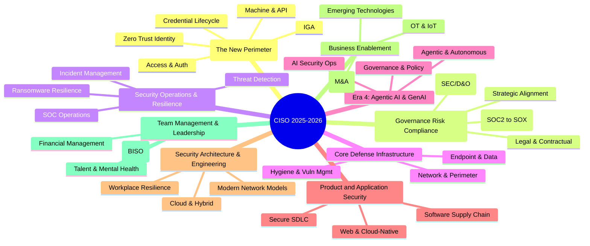

# CISO MindMap 2025 - Modernized

See https://rafeeqrehman.com/ciso-mindmap/

## Identity (The New Perimeter)

### Identity Governance and Administration (IGA)
* Role-Based Access Control (RBAC) & Attribute-Based Access Control (ABAC)
* User Access Reviews (UAR)
* Entitlement Management
* Segregation of Duties (SoD) enforcement

### Identity Credentialing and Lifecycle
* User Provisioning and Identity Life Cycle Management
* HR Process Integration (Onboarding/Offboarding)
* Directory Services (LDAP/Active Directory, Cloud Identity, Local ID stores)
* Unified Identity Profiles

### Access Management and Authentication
* Single Sign On (SSO)
* Federation (SAML, OIDC, Shibboleth)
* 2-Factor (multi-factor) Authentication - MFA
  * Authenticator Apps
  * Tokens and cards
  * One time passcodes
* Password-less Authentication
  * Passkeys
  * Biometrics (Voice, Face)
* Customer Identity and Access Management (CIAM)
* Privileged Access Management (PAM)
* Use of public identity (Google, FB, OAuth, OpenID)

### Machine and API Identity
* API authentication and secrets management
* IoT device identities
* Service accounts & workload identities

### Zero Trust Identity
* IAM with Zero Trust technologies
* Continuous Authentication
* Context-based access

## Governance, Risk, and Compliance (GRC)

### Strategic Alignment and Leadership
* Strategy and business alignment
* Board oversight and board presentations
* Cyber Risk Quantification (CRQ) - FAIR framework
* Security Team Branding
  * Aligning with Corporate Objectives
  * Innovation and Value Creation
  * Negotiation, give and take
  * ROSI (Return on Security Investment)

### Risk Management and Liability
* Enterprise Risk Management (ERM)
* Personal Liability & Indemnification
  * SEC Disclosure Requirements (Materiality)
  * Directors and Officers (D&O) Insurance
* Cyber Risk Insurance
* Maintain Centralized Risk Register
* Third-Party Risk Management (TPRM Automation)

### Compliance and Audits
* The Compliance Transition (SOC 2 vs. SOX 404)
  * SOC 2 as Revenue Enabler (Pre-IPO)
  * SOX 404 as Fiduciary Governance (Post-IPO)
* Global Privacy Regulations (CCPA, GDPR, etc.)
* Industry Standards (PCI, HIPAA/HITECH, HITRUST, DORA)
* Government Standards (NIST/FISMA, CMMC)
* Regular Audits and SSAE 18

### Legal and Contractual
* Data Discovery and Data Ownership
* Vendor Contracts & Indemnification
* Investigations/Forensics
* Attorney-Client Privileges
* Data Retention and Destruction

## Security Operations & Resilience

### Threat Detection (NIST CSF Detect)
* Log Analysis/correlation/SIEM
* Alerting (IDS/IPS, FIM, WAF, Anti-Malware, etc.)
* NetFlow analysis
* Threat hunting and Insider threat
* MSSP/MDR integration
* Threat Detection capability assessment (Gap analysis)

### SOC Operations
* SOC Resource Mgmt
* SOC procedures, Shift management, and Metrics
* SOC and NOC Integration
* Partnerships with ISACs
* Long term trend analysis
* Automation and SOAR (Playbooks)

### Incident Management (NIST CSF Respond & Recover)
* Create adequate Incident Response capability
* Incident Response Playbooks
* Incident Readiness Assessment
* Data Breach Preparation
  * Update and Test IR Plan
  * Set Leadership Expectations
  * Forensic and IR Partner/Retainer
  * Media Relations

### Ransomware and Cyber Resilience
* Identify critical systems
* Perform ransomware BIA (Business Impact Analysis)
* Tie with BC/DR Plans
* Devise containment strategy
* Resilience Equity: Ensure adequate/offline backups
* Periodic mock exercises

### Skills Development
* Machine Learning & Data Analytics
* Understand Algorithm Biases
* MITRE ATT&CK
* Soft skills & Conflict Management

## Core Defense Infrastructure

### Network and Perimeter Security
* Network/Application Firewalls
* Network IPS and IDS
* DDoS Protection
* DNS security/filtering
* Proxy/Content Filtering

### Endpoint and Data Security
* Anti-Malware & EDR
* Email Security
* Desktop & Mobile security
* Data Loss Prevention (DLP)
* Encryption, SSL, PKI, Digital Certificates

### Hygiene and Vulnerability Management
* Vulnerability Management Scope (OS, Apps, DBs, IoT, OT)
* Risk-Based Prioritization (EPSS)
* Patch Management (SLA-driven)
* Hardening guidelines
* Asset Management & Asset Inventory
* Security Health Checks

## Era 4: Agentic AI & GenAI

### AI Governance and Policy
* AI Governance, Policies, Transparency
* Safe and ethical uses of GenAI
* Protecting Intellectual Property
* NIST AI Risk Mgmt Framework
* EU AI Act Compliance

### Agentic AI and Autonomous Systems
* Governing Autonomous Agents
* Agent Hijacking & Prompt Injection defense
* Shadow AI Data Exfiltration detection
* AI Red Teaming

### AI Security Operations
* Securing AI/GenAI models
* Securing training and test data (Model Poisoning)
* Adversarial attacks
* AI-enabled security tools
* Train InfoSec teams on AI technologies
* OWASP Top 10 LLM and GenAI risk

## Product and Application Security

### Secure Development Lifecycle (SDLC)
* Integration to SDLC and Project Delivery
* Embedding security in Project Requirements
* Threat modeling and Design reviews
* Secure Code Training and Review
* Application Vulnerability Testing (SAST/DAST)
* Change Control & File Integrity Monitoring (FIM)

### Software Supply Chain Security
* Inventory open source components (SCA)
* Source code supply chain security (SBOM)
* Public software repositories

### Web and Cloud-Native Security
* Web Application Firewall (WAF)
* API Security
* Containers and Kubernetes security
* Serverless computing security
* Service mesh & microservices

## Security Architecture & Engineering

### Cloud and Hybrid Architecture
* Multi-Cloud architecture strategy
* Cloud Security Posture Management (CSPM)
* Infrastructure as Code (IaC) Security
* Virtualized security appliances

### Modern Network Models
* Traditional Network Segmentation
* Micro-segmentation strategy
* Zero Trust models and roadmap
* SASE/SSE strategy and vendors
* Overlay networks & secure enclaves

### Workplace & Infrastructure Resilience
* Zero trust access to applications
* Secure expanded attack surface (Remote Work)
* Security of sensitive data accessed from home
* Mobile Technologies (BYOD, MDM)

## Business Enablement & Industry Verticals

### Strategic Growth
* Mergers and Acquisitions (M&A)
  * Acquisition Risk Assessment
  * Integration Cost & Tools Rationalization
* Business Partnerships
* Agility, Business Continuity and Disaster Recovery

### Operational Technology (OT) & IoT
* OT/SCADA & Industrial Control Systems (PLCs, HMIs)
* IoT Frameworks & Communication Protocols
* IOT Use cases (Smart Grid, Cities, Communities)
* Edge Computing

### Emerging Technologies
* Evaluating Quantum, Crypto, etc.
* Augmented and Virtual Reality
* Drones

## Team Management & Leadership

### Organizational Design and Roles
* Federated Model (BISO - Business Information Security Officer)
* Virtual CISO (vCISO) model for SMBs
* Alignment with IT, Engineering, and Business units

### Financial Management
* Manage Infosec Budget (CapEx and OpEx)
* Business Case Development
* Consulting and outsourcing
* Retire redundant & under-utilized tools

### Staffing and Talent Management
* Recruiting, performance, and retention
* Addressing the Human Cost: Burnout Prevention & Mental Health
* Balance FTE and contractors
* Staff training and skills update
* Awareness training (Phishing/Associate Awareness)