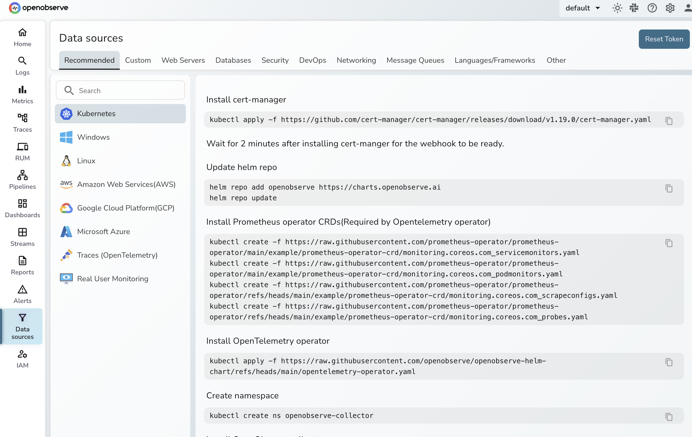

# Installation

This is a basic setup for home lab to get data flowing on the OSS edition


See [Downloads](https://openobserve.ai/downloads/) and pick the following

* Kubernetes
* Latest
* OSS
* Single Node

## Kubernetes customization

Modify the manifest to do the following to use Tailscale 

```
metadata:
  name: openobserve
  namespace: openobserve
  annotations:
    tailscale.com/expose: "true"
spec:
  selector:
    app: openobserve
  ports:
  - name: http
    port: 5080
    targetPort: 5080
---   
```

Set `ZO_ROOT_USER_EMAIL` and `ZO_ROOT_USER_PASSWORD`

# Add Initial Data Sources and OpenTelemetry K8S resources

Following the instructions in the console, install the following:
- cert-manager
- Prometheus Operator CRDs
- OpenTelemetry Operator
- OpenObserve Collector, use the `Default` TAB this should select your proper IP address 



If this is succesful you should see the following pods

```
mfranz@hp-desktop-g2:~/helm/o2$ kubectl get pods -A | grep open
openobserve-collector           o2c-openobserve-collector-agent-collector-78x68              1/1     Running   0              94m
openobserve-collector           o2c-openobserve-collector-agent-collector-bhgrw              1/1     Running   0              94m
openobserve-collector           o2c-openobserve-collector-agent-collector-pcdfp              1/1     Running   0              94m
openobserve-collector           o2c-openobserve-collector-gateway-collector-0                1/1     Running   0              94m
openobserve                     openobserve-0                                                1/1     Running   0              101m
opentelemetry-operator-system   opentelemetry-operator-controller-manager-58c89ff4c8-l8nsb   2/2     Running   0              95m
tailscale                       ts-openobserve-k59pw-0                                       1/1     Running   0              101m
```

## Add Linux Instances

Follow the UI instructions and command for Linux data sources

You can modify `/etc/otel-config.yaml` to tweak the receivers

```
receivers:
  journald:
    directory: /var/log/journal
  filelog/std:
    include: [ /var/log/**log ]
    # start_at: beginning
```

and  the exporters, if you wanted to send to a different stream than default or remove 

```
exporters:
  otlphttp/openobserve:
    endpoint: http://100.87.235.81:5080/api/default/
    headers:
```
