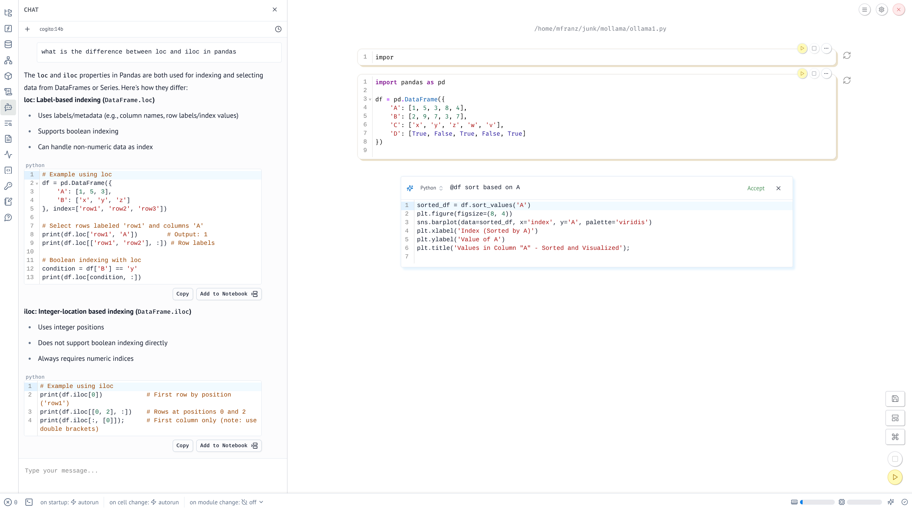

# Using with Ollama

Edit your `~/.config/marimo/marimo.toml` to contain

```
[ai.open_ai]
model = "cogito:14b"
api_key = "ollama"
base_url = "http://1.2.3.4:11434/v1"
```

And you should be able to do this 

See [Local models with Ollama](https://docs.marimo.io/guides/editor_features/ai_completion/#using-ollama)
